# 🚀 JavaScript Tricks & One-Liners Playground

<div align="center">


*A comprehensive, interactive React TypeScript tutorial showcasing powerful JavaScript tricks, one-liners, and advanced patterns.*

[**🎮 Live Demo**](https://your-demo-url.vercel.app) | [**📖 Documentation**](#documentation) | [**🤝 Contributing**](#contributing)

</div>

---

## ✨ Features

<table>
<tr>
<td width="50%">

### 🎯 **Interactive Learning**
- 📋 **One-Click Copy** - Copy any code snippet instantly
- 🖥️ **Live Results** - See output in real-time
- 💡 **Detailed Explanations** - Understand how each trick works
- 📱 **Responsive Design** - Perfect on all devices

</td>
<td width="50%">

### 🛠️ **Modern Tech Stack**
- ⚛️ **React 19** - Latest React with hooks
- 🔷 **TypeScript** - Full type safety
- 🎨 **Modern CSS** - Beautiful gradients & animations
- 🚀 **Vercel Ready** - Optimized for deployment

</td>
</tr>
</table>

---

## 📚 Categories & Tricks

<details>
<summary><strong>🔢 Array Manipulation (16+ tricks)</strong></summary>

```javascript
// Remove duplicates with Set
const unique = [...new Set([1, 2, 2, 3, 4, 4])] // [1, 2, 3, 4]

// Flatten nested arrays
const flat = [1, [2, 3, [4, 5]]].flat(Infinity) // [1, 2, 3, 4, 5]

// Get random element
const random = arr[~~(Math.random() * arr.length)]

// Group by property
const groupBy = (arr, key) => arr.reduce((acc, obj) => (
  (acc[obj[key]] = acc[obj[key]] || []).push(obj), acc
), {})
```

**More tricks**: Sum arrays, chunk arrays, array intersection, rotate arrays, and more!

</details>

<details>
<summary><strong>📝 String Processing (18+ tricks)</strong></summary>

```javascript
// Reverse string
const reversed = [...'hello'].reverse().join('') // 'olleh'

// Title case
const titleCase = str => str.replace(/\b\w/g, l => l.toUpperCase())

// Generate slug
const slugify = str => str.toLowerCase().trim()
  .replace(/[^\w\s-]/g, '').replace(/[\s_-]+/g, '-')

// Check palindrome
const isPalindrome = str => str === str.split('').reverse().join('')
```

**More tricks**: Anagram detection, phone formatting, character counting, string masking, and more!

</details>

<details>
<summary><strong>📦 Object Operations (16+ tricks)</strong></summary>

```javascript
// Swap variables
[a, b] = [b, a]

// Deep merge objects
const deepMerge = (a, b) => Object.keys({...a, ...b}).reduce((acc, key) => ({
  ...acc, [key]: a[key]?.constructor === Object && b[key]?.constructor === Object 
    ? deepMerge(a[key], b[key]) : b[key] ?? a[key]
}), {})

// Safe property access
const get = (obj, path, def) => path.split('.').reduce((o, p) => o?.[p], obj) ?? def
```

**More tricks**: Object flattening, pick/omit properties, invert objects, and more!

</details>

<details>
<summary><strong>🔢 Number & Math Operations</strong></summary>

```javascript
// Round to decimal places
const rounded = Math.round(num * 100) / 100

// Random in range
const randomInRange = (min, max) => Math.random() * (max - min) + min

// Format currency
const money = n => new Intl.NumberFormat('en-US', {
  style: 'currency', currency: 'USD'
}).format(n)
```

</details>

<details>
<summary><strong>⚡ Functional Programming</strong></summary>

```javascript
// Pipe functions
const pipe = (...fns) => x => fns.reduce((v, f) => f(v), x)

// Memoization
const memo = fn => (cache => x => cache[x] ??= fn(x))({})

// Currying
const curry = fn => (...args) => args.length >= fn.length 
  ? fn(...args) : curry(fn.bind(null, ...args))
```

</details>

<details>
<summary><strong>🏆 LeetCode & Algorithm Tricks</strong></summary>

```javascript
// Two-pointer technique
const twoSum = (arr, target) => {
  let l = 0, r = arr.length - 1
  while (l < r) arr[l] + arr[r] === target ? [l, r] : arr[l] + arr[r] < target ? l++ : r--
}

// Sliding window
const maxSum = (arr, k) => Math.max(...arr.slice(0, -k + 1)
  .map((_, i) => arr.slice(i, i + k).reduce((a, b) => a + b)))

// Binary search
const binarySearch = (arr, target) => /* implementation */
```

</details>

<details>
<summary><strong>🌐 DOM & Browser Tricks</strong></summary>

```javascript
// Query selector shortcuts
const $ = document.querySelector.bind(document)
const $$ = document.querySelectorAll.bind(document)

// Copy to clipboard
navigator.clipboard.writeText(text)

// Detect mobile
const isMobile = () => /iPhone|iPad|iPod|Android/i.test(navigator.userAgent)
```

</details>

---

## 🚀 Quick Start

### Prerequisites
- **Node.js** 16+ 
- **npm** or **yarn**

### Installation

```bash
# Clone the repository
git clone https://github.com/davidagustin/javascript-tricks-playground.git
cd javascript-tricks-playground

# Install dependencies
npm install

# Start development server
npm start

# Build for production
npm run build
```

### Available Scripts

| Command | Description |
|---------|-------------|
| `npm start` | Start development server at `http://localhost:3000` |
| `npm run build` | Create production build in `build/` folder |
| `npm test` | Run test suite |
| `npm run eject` | Eject from Create React App (⚠️ one-way operation) |

---

## 🎯 How to Use

<table>
<tr>
<td width="33%">

### 1️⃣ **Browse Categories**
Click any category to explore different JavaScript tricks organized by topic.

</td>
<td width="33%">

### 2️⃣ **Study Examples**
Each trick includes:
- Working code example
- Live result output  
- Detailed explanation
- Performance notes

</td>
<td width="33%">

### 3️⃣ **Practice & Apply**
- Copy code snippets
- Experiment with variations
- Use in your projects
- Build your own tricks

</td>
</tr>
</table>

---

## 📈 Learning Path

```mermaid
graph TD
    A[🚀 Start Here] --> B[🔢 Arrays & Strings]
    B --> C[📦 Objects & Numbers]
    C --> D[⚡ Functional Programming]
    D --> E[🏆 Algorithms & Performance]
    E --> F[🚀 Advanced Patterns]
    
    B --> G[💡 Practice Projects]
    C --> G
    D --> G
    E --> G
    F --> G
```



| Level | Topics | Skills Gained |
|-------|--------|---------------|
| **🟢 Beginner** | Arrays, Strings, Basic Objects | Data manipulation fundamentals |
| **🟡 Intermediate** | Advanced Objects, Numbers, DOM | Complex data structures & browser APIs |
| **🟠 Advanced** | Functional Programming, Async | Higher-order thinking, performance |
| **🔴 Expert** | Algorithms, Advanced Patterns | Competitive programming, optimization |

---

## 🚀 Deployment

### Deploy to Vercel (Recommended)

[](https://vercel.com/new/clone?repository-url=https://github.com/davidagustin/javascript-tricks-playground)

#### Manual Deployment

```bash
# Install Vercel CLI
npm i -g vercel

# Deploy
vercel

# Or connect GitHub repo at vercel.com
```

### Deploy to Netlify

[](https://app.netlify.com/start/deploy?repository=https://github.com/davidagustin/javascript-tricks-playground)

### Build Configuration

The project includes optimized configuration:

- ✅ **TypeScript**: ES2017 target with strict mode
- ✅ **Build Output**: Optimized `build/` directory  
- ✅ **Static Assets**: Proper caching headers
- ✅ **SPA Routing**: Client-side navigation support
- ✅ **Performance**: Code splitting & compression

---

## 🤝 Contributing

We welcome contributions! Here's how you can help:

<table>
<tr>
<td width="50%">

### 🆕 **Add New Tricks**
- Submit JavaScript one-liners
- Include working examples
- Add clear explanations
- Follow existing patterns

### 🐛 **Fix Issues**
- Report bugs via GitHub Issues
- Submit pull requests
- Improve documentation
- Enhance performance

</td>
<td width="50%">

### 🎨 **Improve UI/UX**
- Enhance visual design
- Improve mobile experience
- Add animations
- Optimize accessibility

### 📖 **Documentation**
- Clarify explanations
- Add more examples
- Improve README
- Create tutorials

</td>
</tr>
</table>

### Development Workflow

```bash
# 1. Fork & clone
git clone https://github.com/davidagustin/javascript-tricks-playground.git

# 2. Create feature branch
git checkout -b feature/amazing-trick

# 3. Make changes & test
npm test
npm run build

# 4. Commit with conventional commits
git commit -m "feat: add amazing array trick"

# 5. Push & create PR
git push origin feature/amazing-trick
```

---

## 📊 Performance

<div align="center">

| Metric | Value | Status |
|--------|-------|--------|
| **Bundle Size** | ~67KB gzipped | ✅ Optimized |
| **CSS Size** | ~1.7KB gzipped | ✅ Minimal |
| **Load Time** | <2s on 3G | ✅ Fast |
| **Lighthouse Score** | 95+ | ✅ Excellent |

</div>

### Build Optimizations

- 🔄 **Code Splitting**: Automatic chunk optimization
- 🗜️ **Compression**: Gzip + Brotli support
- 🌍 **CDN**: Global content delivery
- ⚡ **Caching**: 1-year static asset cache
- 📱 **Mobile**: Responsive design patterns

---

## 🛡️ Browser Support

| Browser | Version | Support |
|---------|---------|---------|
| **Chrome** | 90+ | ✅ Full |
| **Firefox** | 88+ | ✅ Full |
| **Safari** | 14+ | ✅ Full |
| **Edge** | 90+ | ✅ Full |

### JavaScript Features Used

- ✅ ES2017+ syntax
- ✅ Optional chaining (`?.`)
- ✅ Nullish coalescing (`??`)
- ✅ Modern array methods
- ✅ Async/await patterns

---

## 📄 License

```
MIT License

Copyright (c) 2024 JavaScript Tricks Playground

Permission is hereby granted, free of charge, to any person obtaining a copy
of this software and associated documentation files (the "Software"), to deal
in the Software without restriction, including without limitation the rights
to use, copy, modify, merge, publish, distribute, sublicense, and/or sell
copies of the Software, and to permit persons to whom the Software is
furnished to do so, subject to the following conditions:

The above copyright notice and this permission notice shall be included in all
copies or substantial portions of the Software.

THE SOFTWARE IS PROVIDED "AS IS", WITHOUT WARRANTY OF ANY KIND, EXPRESS OR
IMPLIED, INCLUDING BUT NOT LIMITED TO THE WARRANTIES OF MERCHANTABILITY,
FITNESS FOR A PARTICULAR PURPOSE AND NONINFRINGEMENT.
```

---

## 🙏 Acknowledgments

<div align="center">

**Built with ❤️ using**


</div>

- 🌟 Inspired by the amazing JavaScript community
- 🎨 UI patterns from modern web design trends  
- 📚 Tricks collected from various programming resources
- 🚀 Optimized for modern development workflows

---

## 📞 Support & Community

<div align="center">

### 💬 **Get Help**

[](https://github.com/davidagustin/javascript-tricks-playground/issues)
[](https://github.com/davidagustin/javascript-tricks-playground/discussions)

### 🌟 **Show Your Support**

If this project helped you, please ⭐ star it on GitHub!

[](https://github.com/davidagustin/javascript-tricks-playground/stargazers)
[](https://github.com/davidagustin/javascript-tricks-playground/network/members)

</div>

---

<div align="center">

**🎉 Happy Coding! 🎉**

*Remember: The best way to learn is by doing. Try these tricks in your own projects and experiment with variations!*

</div>